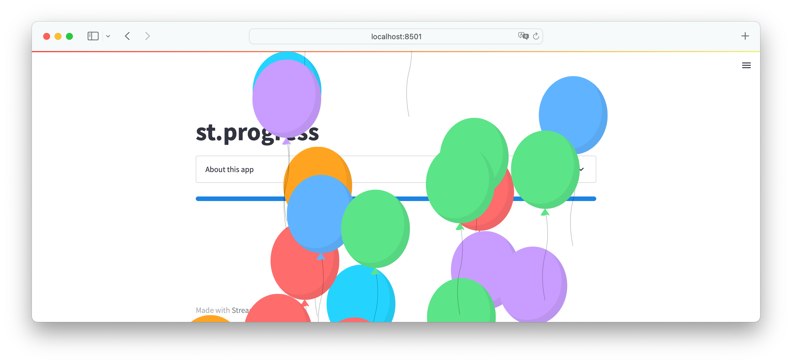
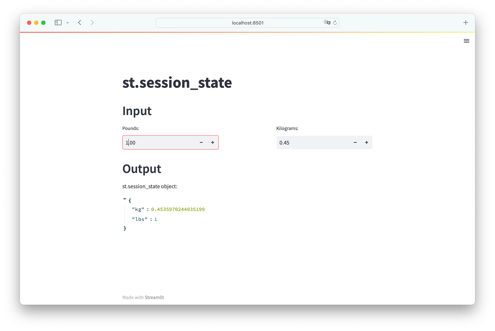

# 1. Streamlit Intro
Streamlit is a Python library that allows the creation of interactive, data-driven web applications in Python.

## Setup
1. install Miniconda from `https://docs.conda.io/en/latest/miniconda.html`
2. create a new environment with Python 3.9 with `conda create -n stenv python=3.9`
3. activate the conda env: `conda activate stenv`. A conda environment is a folder or directory that contains a specific collection of conda packages and their dependencies. This allows them to be maintained and run separately without interference from each other.
4. install the Streamlit library: `pip install streamlit`
5. launch the Streamlit demo app: `streamlit hello`


## The "Hello World" app
Create a file "streamlit_app.py":
```py
# set 'stenv' as interpreter for the IDE
import streamlit as st
st.write('Hello world!')
```

To run the app, in the terminal:
```console
(base) lisa@mac16 python % conda info --envs
# conda environments:
#
base                  *  /Users/lisa/miniconda3
                         /Users/lisa/opt/anaconda3/envs/stenv

(base) lisa@mac16 python % conda activate /Users/lisa/opt/anaconda3/envs/stenv

(stenv) lisa@mac16 python % cd 02-streamlit  # cd to the folder that has the .py file

(stenv) lisa@mac16 02-streamlit % streamlit run streamlit_app.py  

  You can now view your Streamlit app in your browser.

  Local URL: http://localhost:8501
  Network URL: http://192.168.0.194:8501

  For better performance, install the Watchdog module:

  $ xcode-select --install
  $ pip install watchdog
           
```
And the app opens in the browser:


## Streamlit button
```py
st.header('st.button') # header text
if st.button('click me, I am a button'): # button has text str; clause returns true if button is clicked
    st.write('The button was clicked') # write this text to the screen
else:
    st.write('The button has not been clicked')
```

Run the app, it displays:


If we click the button, it then displays:


## Data Science portfolio project
This dashboard analyzes Ken Jee's YouTube channel. It shows the KPIs that he would like to see as a YouTuber. It contains these pages:
- Aggregate metrics - overall channel health; performance in the last 6 mo vs the baseline; how each individual video performed against the baseline 
- Individual video analysis - num of views vs subscription in diff countries; views of this video in first 30 days compared to average, top 20%, top 80% videos 

See details in the folder `youtube-data-analysis`

## st.write()
st.write allows add the following to the Streamlit app: 
- Prints strings, works like st.markdown()
- Displays a Python dict
- Displays pandas DataFrame as a table
- Plots/graphs/figures from matplotlib, plotly, altair, graphviz, bokeh
- ...

```py
import numpy as np
import altair as alt
import pandas as pd
import streamlit as st

st.header('st.write()')
st.write('Hello, *World!* :sunglasses:') # can display text using markdown format
st.write(1234) # display a number
df = pd.DataFrame({
     'first column': [1, 2, 3, 4],
     'second column': [10, 20, 30, 40]
     })
st.write(df) # display a dataframe as table
df2 = pd.DataFrame(
     np.random.randn(200, 3),
     columns=['a', 'b', 'c'])
c = alt.Chart(df2).mark_circle().encode(
     x='a', y='b', size='c', color='c', tooltip=['a', 'b', 'c'])
st.write(c) # display a chart plot
```

Run the app, it displays:


## Deploy the app to Streamlit Community Cloud
Register at `https://share.streamlit.io/` and link GibHub account. 

Fill in the repo and path: 


Click "Deploy" and the app is deployed to the public cloud. Then any time you do a git push your app will update immediately.


## st.slider()
st.slider() displays a slider input widget. Data types supported: int, float, date, time, and datetime.
```py
import streamlit as st
from datetime import time, datetime

st.header('st.slider')

st.subheader('Slider')
age = st.slider('How old are you?', 0, 130, 10) # returns the val of the slider
#                text of slider     min/max, default val
st.write("I'm ", age, 'years old')

st.subheader('Range slider')
values = st.slider(
     'Select a range of values',
     0.0, 100.0, (25.0, 75.0))
#                tuple of default range
st.write('Values:', values)

st.subheader('Range time slider')
appointment = st.slider(
     "Schedule your appointment:",
     value=(time(11, 30), time(13, 45)))
#    default value range as a tuple, need to specify value because skipped min/max value
st.write("You're scheduled for:", appointment)

st.subheader('Datetime slider')
start_time = st.slider(
     "When do you start?",
     value=datetime(2020, 1, 1, 9, 30),
     format="MM/DD/YY - hh:mm")
#    sets the default display format of values
st.write("Start time:", start_time)
```


## st.line_chart()
Good for "just plot this" scenarios, but less customizable. If `st.line_chart` does not guess the data specification correctly, try specifying your desired chart using `st.altair_chart`.

```py
import streamlit as st
import pandas as pd
import numpy as np

st.header('Line chart')

chart_data = pd.DataFrame(
    np.random.randn(20, 3),
    columns=['a', 'b', 'c'])
print(chart_data)
#            a         b         c
# 0   1.604629 -0.561202 -1.756648
# 1   0.234535 -0.639890  0.188274
# 2  -2.185051  2.692159  0.851398
# ...
# 19  0.720349 -2.312322 -0.143059
st.line_chart(chart_data)
```


## st.selectbox()
```py
import streamlit as st

st.header('st.selectbox')
option = st.selectbox(
     'What is your favorite color?', # display the question
     ('Blue', 'Red', 'Green')) # choices for users
st.write('Your favorite color is ', option)
```


## st.multiselect()
```py
import streamlit as st
st.header('st.multiselect')
options = st.multiselect(
     'What are your favorite colors', # question to display
     ['Green', 'Yellow', 'Red', 'Blue'], # list of choices
     ['Yellow', 'Red']) # default choices
st.write('You selected:', options)
```


## st.checkbox
```py
import streamlit as st
st.header('st.checkbox')
st.write ('What would you like to order?')
icecream = st.checkbox('Ice cream')
coffee = st.checkbox('Coffee')
cola = st.checkbox('Cola')
if icecream:
     st.write("Great! Here's some more 🍦")
if coffee: 
     st.write("Okay, here's some coffee ☕")
if cola:
     st.write("Here you go 🥤")
```


## Streamlit Components
Components are third-party Python modules that extend Streamlit, such as `streamlit_pandas_profiling`
```py
import streamlit as st
import pandas as pd
import pandas_profiling
from streamlit_pandas_profiling import st_profile_report # pip install streamlit_pandas_profiling

st.header('`streamlit_pandas_profiling`')
df = pd.read_csv('https://raw.githubusercontent.com/dataprofessor/data/master/penguins_cleaned.csv')
pr = df.profile_report() # generate pandas profiling report
st_profile_report(pr) # display
```


## st.latex
Display math expressions formatted as LaTeX.
```py
import streamlit as st

st.header('st.latex')
st.latex(r'''
     a + ar + a r^2 + a r^3 + \cdots + a r^{n-1} =
     \sum_{k=0}^{n-1} ar^k =
     a \left(\frac{1-r^{n}}{1-r}\right)
     ''')
```


## App theme customization
Create a theme file in the follow path: `.streamlit/config.toml`, and put the following content in:
```
[theme]
primaryColor="#F39C12"
backgroundColor="#2E86C1"
secondaryBackgroundColor="#AED6F1"
textColor="#FFFFFF"
font="monospace"
```

And in the python file: 
```py
import streamlit as st
st.title('Customizing the theme of Streamlit apps')
st.write('Contents of the `.streamlit/config.toml` file of this app')
st.code("""
[theme]
primaryColor="#F39C12"
backgroundColor="#2E86C1"
secondaryBackgroundColor="#AED6F1"
textColor="#FFFFFF"
font="monospace"
""") # display a code block
number = st.sidebar.slider('Select a number:', 0, 10, 5)
st.write('Selected number from slider widget is:', number)
```

Note that although `streamlit run file.py` could refresh the app when the contents of the file changes, but to allow it to incorporate this theme file, we need to re-run this command. 


## st.secrets
Store confidential info such as API keys, database passwords, etc.
```py
import streamlit as st
st.title('st.secrets')
st.write(st.secrets['message'])
```
Secrets can be stored in Streamlit Community Cloud, or, if working locally, they can be stored in `.streamlit/secrets.toml`, but make sure to NOT uploading it to a GitHub repo when deploying the app.

## st.file_uploader
By default, uploaded files are limited to 200MB. You can configure this using the server.maxUploadSize config option.
```py
import streamlit as st
import pandas as pd

st.title('st.file_uploader')
st.subheader('Input CSV')
uploaded_file = st.file_uploader("Choose a file")
if uploaded_file is not None:
  df = pd.read_csv(uploaded_file)
  st.subheader('DataFrame')
  st.write(df)
  st.subheader('Descriptive Statistics')
  st.write(df.describe())
else:
  st.info('☝️ Upload a CSV file')
```


## layouts
```py
import streamlit as st

st.set_page_config(layout="wide") # displays the page in wide mode, otherwise the contents are in a fixed width box by default
st.title('How to layout your Streamlit app')
with st.expander('About this app'): # text/image inside a collapsible container box
  st.write('This app shows the various ways on how you can layout your Streamlit app.')
  st.image('https://streamlit.io/images/brand/streamlit-logo-secondary-colormark-darktext.png', width=250)

st.sidebar.header('Input')
user_name = st.sidebar.text_input('What is your name?')
user_emoji = st.sidebar.selectbox('Choose an emoji', ['', '😄', '😆', '😊', '😍', '😴', '😕', '😱'])
user_food = st.sidebar.selectbox('What is your favorite food?', ['', 'Tom Yum Kung', 'Burrito', 'Lasagna', 'Hamburger', 'Pizza'])

st.header('Output')

col1, col2, col3 = st.columns(3) # create 3 cols

with col1:
  if user_name != '':
    st.write(f'👋 Hello {user_name}!')
  else:
    st.write('👈  Please enter your **name**!')

with col2:
  if user_emoji != '':
    st.write(f'{user_emoji} is your favorite **emoji**!')
  else:
    st.write('👈 Please choose an **emoji**!')

with col3:
  if user_food != '':
    st.write(f'🍴 **{user_food}** is your favorite **food**!')
  else:
    st.write('👈 Please choose your favorite **food**!')
```


## st.progress
Displays a progress bar that updates graphically as the iteration progresses.

```py
import streamlit as st
import time

st.title('st.progress')
with st.expander('About this app'):
     st.write('You can now display the progress of your calculations in a Streamlit app with the `st.progress` command.')
my_bar = st.progress(0) # 0 is starting val
for percent_complete in range(100):
     time.sleep(0.05)
     my_bar.progress(percent_complete + 1)
st.balloons()
```



## st.form
Creates a form that batches elements together with a "Submit" button.

Typically, when a user interacts with a widget, the Streamlit app is rerun. A form is a container that visually groups elements/widgets together, so a user can interact with widgets for as many times as they like without causing a rerun. Finally, when the form's Submit button is pressed, all widget values inside the form will be sent to Streamlit in a single batch.

To add elements to a form object, you can use the with notation (preferred). 

Constraints:
- Every form must contain a st.form_submit_button.
- st.button and st.download_button cannot be added to a form.
- Forms can appear anywhere in your app (sidebar, columns, etc), but they cannot be nested in other forms.

```py
import streamlit as st

st.title('st.form')

# Full example of using the with notation
st.header('1. Example of using `with` notation (recommended)')
st.subheader('Coffee machine')

with st.form('my_form'):
    st.subheader('**Order your coffee**')
    # Input widgets
    coffee_bean_val = st.selectbox('Coffee bean', ['Arabica', 'Robusta'])
    coffee_roast_val = st.selectbox('Coffee roast', ['Light', 'Medium', 'Dark'])
    brewing_val = st.selectbox('Brewing method', ['Aeropress', 'Drip', 'French press', 'Moka pot', 'Siphon'])
    serving_type_val = st.selectbox('Serving format', ['Hot', 'Iced', 'Frappe'])
    milk_val = st.select_slider('Milk intensity', ['None', 'Low', 'Medium', 'High'])
    owncup_val = st.checkbox('Bring own cup')
    submitted = st.form_submit_button('Submit') # Every form must have a submit button

if submitted:
    st.markdown(f'''
        ☕ You have ordered:
        - Coffee bean: `{coffee_bean_val}`
        - Coffee roast: `{coffee_roast_val}`
        - Brewing: `{brewing_val}`
        - Serving type: `{serving_type_val}`
        - Milk: `{milk_val}`
        - Bring own cup: `{owncup_val}`
        ''')
else:
    st.write('☝️ Place your order!')

# Short example of using an object notation
st.header('2. Example of object notation')
form = st.form('my_form_2')
selected_val = form.slider('Select a value')
form.form_submit_button('Submit')
st.write('Selected value: ', selected_val)
```


## st.experimental_get_query_params
Retrieve query parameters directly from the URL of the user's browser.
```py
import streamlit as st

st.title('st.experimental_get_query_params')
with st.expander('About this app'):
  st.write("`st.experimental_get_query_params` allows the retrieval of query parameters directly from the URL of the user's browser.")

# 1. Instructions
st.header('1. Instructions')
st.markdown('''
In the URL bar of your browser, append the following:
`?firstname=Jack&surname=Beanstalk`
after the base URL `http://share.streamlit.io/dataprofessor/st.experimental_get_query_params/`
such that it becomes 
`http://share.streamlit.io/dataprofessor/st.experimental_get_query_params/?firstname=Jack&surname=Beanstalk`
''')

# 2. Contents of st.experimental_get_query_params
st.header('2. Contents of st.experimental_get_query_params')
st.write(st.experimental_get_query_params())

# 3. Retrieving and displaying information from the URL
st.header('3. Retrieving and displaying information from the URL')
firstname = st.experimental_get_query_params()['firstname'][0]
surname = st.experimental_get_query_params()['surname'][0]
st.write(f'Hello **{firstname} {surname}**, how are you?')
```


## st.cache
Used to optimize the performance of your Streamlit app. Allows your app to stay performant even when loading data from the web, manipulating large datasets, or performing expensive computations, with the `@st.cache` decorator.

When you mark a function with the `@st.cache` decorator, it tells Streamlit that whenever the function is called it needs to check 4 things:
1. The input param that the function is called with
2. The val of any external variable used in the function
3. The body of the function
4. The body of functions used inside the cached function

If this is the first time Streamlit has seen these 4 components with these exact values, it runs the function and stores the result in a local cache. Then, next time the cached function is called, if none of these components changed, Streamlit will just use the cache.

`@st.cache` supports arguments to configure the cache's behavior. 

```py
import streamlit as st
import numpy as np
import pandas as pd
from time import time
st.title('st.cache_data')

# Using cache
a0 = time()
st.subheader('Using st.cache_data')
@st.cache_data()
def load_data_a():
  df = pd.DataFrame(
    np.random.rand(2000000, 5),
    columns=['a', 'b', 'c', 'd', 'e']
  )
  return df
st.write(load_data_a())
a1 = time()
st.info(a1-a0)

# Not using cache
b0 = time()
st.subheader('Not using st.cache')
def load_data_b():
  df = pd.DataFrame(
    np.random.rand(2000000, 5),
    columns=['a', 'b', 'c', 'd', 'e']
  )
  return df
st.write(load_data_b())
b1 = time()
st.info(b1-b0)
```

The first run may provide roughly similar run time. Reload the app and notice the run time decrease when using the st.cache decorator.

## st.session_state
Allows to share variables between reruns, within each user session.

The access to a Streamlit app in a browser tab is called a session. For each browser tab that connects to the Streamlit server, a new session is created - Streamlit reruns your script from top to bottom every time. Each rerun takes place in a blank slate: no variables are shared between runs.

Session State is a way to share variables between reruns, for each user session. In addition to the ability to store and persist state, Streamlit also exposes the ability to manipulate state using Callbacks.

```py
import streamlit as st
st.title('st.session_state')

def lbs_to_kg():
  st.session_state.kg = st.session_state.lbs/2.2046
def kg_to_lbs():
  st.session_state.lbs = st.session_state.kg*2.2046

st.header('Input')
col1, spacer, col2 = st.columns([2,1,2])
with col1:
  pounds = st.number_input("Pounds:", key = "lbs", on_change = lbs_to_kg) # with key "lbs", st.session_state.lbs now exists!
with col2:
  kilogram = st.number_input("Kilograms:", key = "kg", on_change = kg_to_lbs) # with key "kg", st.session_state.kg now exists!

st.header('Output')
st.write("st.session_state object:", st.session_state)
```

Whenever a value in pounds input box changes, the corresponding session var `lbs` changes to the value in the box, and this val change in the box makes `lbs_to_kg` function to run, which updates the `kg` session variable to match the lbs value. And vise versa can happen for the kilograms input box. 



## Use API within a Streamlit app
```py
import streamlit as st
import requests

st.title('🏀 Bored API app')

st.sidebar.header('Input')
selected_type = st.sidebar.selectbox('Select an activity type', ["education", "recreational", "social", "diy", "charity", "cooking", "relaxation", "music", "busywork"])

suggested_activity_url = f'http://www.boredapi.com/api/activity?type={selected_type}'
json_data = requests.get(suggested_activity_url)
suggested_activity = json_data.json()

c1, c2 = st.columns(2)
with c1:
  with st.expander('About this app'):
    st.write('Are you bored? The **Bored API app** provides suggestions on activities that you can do when you are bored. This app is powered by the Bored API.')
with c2:
  with st.expander('JSON data'):
    st.write(suggested_activity)

st.header('Suggested activity')
st.info(suggested_activity['activity'])

col1, col2, col3 = st.columns(3)
with col1:
  st.metric(label='Number of Participants', value=suggested_activity['participants'], delta='')
with col2:
  st.metric(label='Type of Activity', value=suggested_activity['type'].capitalize(), delta='')
with col3:
  st.metric(label='Price', value=suggested_activity['price'], delta='')
```


## Draggable and resizable dashboard
Streamlit Elements is a third-party component made by okld that gives you the tools to compose beautiful applications and dashboards with Material UI widgets, Monaco editor (Visual Studio Code), Nivo charts, and more.
```py
import json
import streamlit as st
from pathlib import Path
from streamlit_elements import elements, dashboard, mui, editor, media, lazy, sync, nivo # pip install streamlit-elements

st.set_page_config(layout="wide")

with st.sidebar:
    st.title("🗓️ #30DaysOfStreamlit")
    st.header("Day 27 - Streamlit Elements")
    st.write("Build a draggable and resizable dashboard with Streamlit Elements.")
    st.write("---")

    # URL for media player.
    media_url = st.text_input("Media URL", value="https://www.youtube.com/watch?v=vIQQR_yq-8I")

# data for code editor and chart, session state item will be updated when code changes
if "data" not in st.session_state:
    st.session_state.data = Path("data.json").read_text()

# Define a default dashboard layout. Dashboard grid has 12 columns by default.
layout = [
    # Editor item at x=0 and y=0, takes 6/12 columns and has a height of 3.
    dashboard.Item("editor", 0, 0, 6, 3),
    # Chart item at x=6 and y=0, takes 6/12 columns and has a height of 3.
    dashboard.Item("chart", 6, 0, 6, 3),
    # Media item at x=0 and y=3, takes 6/12 columns and has a height of 4.
    dashboard.Item("media", 0, 2, 12, 4),
]

with elements("demo"): # Create a frame to display elements.
    # a new dashboard with the specified layout
    with dashboard.Grid(layout, draggableHandle=".draggable"): # CSS query selector to define the draggable part of each dashboard item.

        # 1. the code editor
        # To make card's content automatically fill the height available, use CSS flexbox.
        # sx defines CSS attributes.
        with mui.Card(key="editor", sx={"display": "flex", "flexDirection": "column"}):
            mui.CardHeader(title="Editor", className="draggable")
            with mui.CardContent(sx={"flex": 1, "minHeight": 0}):
                editor.Monaco(
                    defaultValue=st.session_state.data,
                    language="json",
                    onChange=lazy(sync("data"))
                )

            with mui.CardActions:
                mui.Button("Apply changes", onClick=sync())

        # 2. the Nivo Bump chart
        with mui.Card(key="chart", sx={"display": "flex", "flexDirection": "column"}):
            mui.CardHeader(title="Chart", className="draggable")
            with mui.CardContent(sx={"flex": 1, "minHeight": 0}):
                nivo.Bump(
                    data=json.loads(st.session_state.data),
                    colors={ "scheme": "spectral" },
                    lineWidth=3,
                    activeLineWidth=6,
                    inactiveLineWidth=3,
                    inactiveOpacity=0.15,
                    pointSize=10,
                    activePointSize=16,
                    inactivePointSize=0,
                    pointColor={ "theme": "background" },
                    pointBorderWidth=3,
                    activePointBorderWidth=3,
                    pointBorderColor={ "from": "serie.color" },
                    axisTop={
                        "tickSize": 5,
                        "tickPadding": 5,
                        "tickRotation": 0,
                        "legend": "",
                        "legendPosition": "middle",
                        "legendOffset": -36
                    },
                    axisBottom={
                        "tickSize": 5,
                        "tickPadding": 5,
                        "tickRotation": 0,
                        "legend": "",
                        "legendPosition": "middle",
                        "legendOffset": 32
                    },
                    axisLeft={
                        "tickSize": 5,
                        "tickPadding": 5,
                        "tickRotation": 0,
                        "legend": "ranking",
                        "legendPosition": "middle",
                        "legendOffset": -40
                    },
                    margin={ "top": 40, "right": 100, "bottom": 40, "left": 60 },
                    axisRight=None,
                )

        # 3. the Media player
        with mui.Card(key="media", sx={"display": "flex", "flexDirection": "column"}):
            mui.CardHeader(title="Media Player", className="draggable")
            with mui.CardContent(sx={"flex": 1, "minHeight": 0}):
                media.Player(url=media_url, width="100%", height="100%", controls=True)
```

## streamlit-shap
streamlit-shap is a Streamlit component that provides a wrapper to display SHAP plots in Streamlit.

## my notes
- Clicking a button will not cause the page to reload, instead, its status is set to "got clicked"
- Selecting a checkbox will cause the app to reload. So if use a checkbox inside a button, the button's state will be lost from refreshing the page when the checkbox got selected (reset to not-got-clicked). So if you use a button, make sure it is the last nested button you use. 

## References
- `https://30days.streamlit.app/`
- `https://docs.streamlit.io/library/api-reference`
- `https://share.streamlit.io/`
- `https://www.youtube.com/watch?v=Yk-unX4KnV4`


