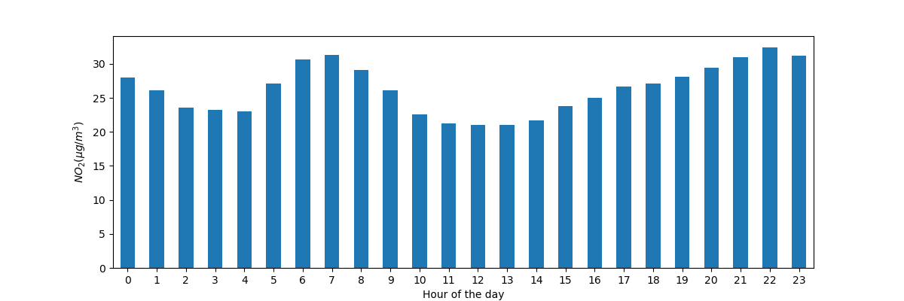
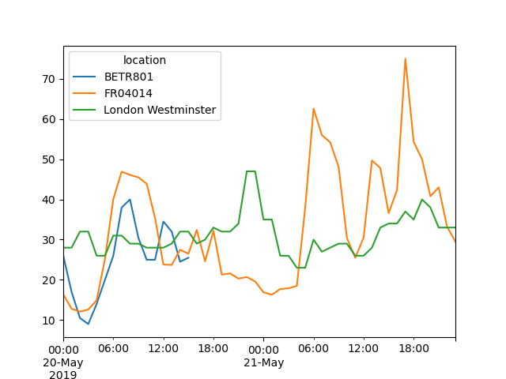
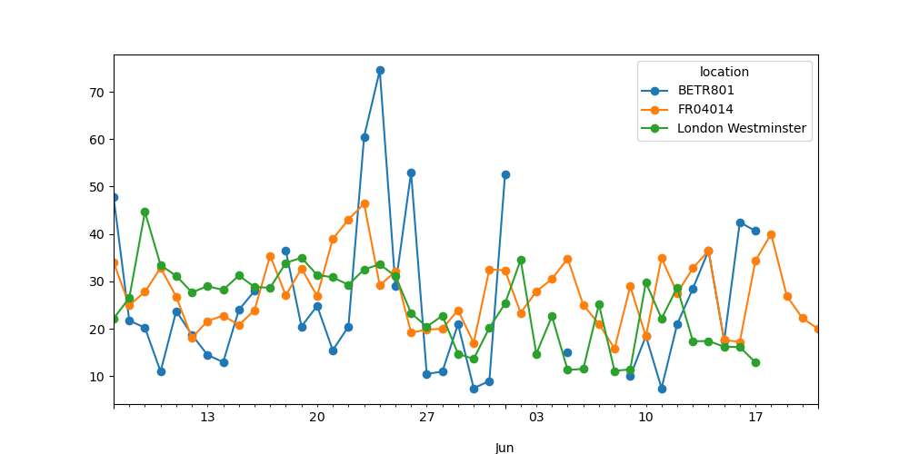

# Pandas
pandas is an open source, BSD-licensed library providing high-performance, easy-to-use data structures and data analysis tools for Python. 

## intro
```py
import pandas as pd # pip install pandas

df = pd.DataFrame(
    { # col header as dict key, col vals as dict vals
        "Name": [
            "Braund, Mr. Owen Harris",
            "Allen, Mr. William Henry",
            "Bonnell, Miss. Elizabeth",
        ],
        "Age": [22, 35, 58],
        "Sex": ["male", "male", "female"],
    }
)
print(df)
#                        Name  Age     Sex
# 0   Braund, Mr. Owen Harris   22    male
# 1  Allen, Mr. William Henry   35    male
# 2  Bonnell, Miss. Elizabeth   58  female

print(df['Age']) # a col without label is also called a series in pandas, they have row labels, but not col label
# 0    22
# 1    35
# 2    58
# Name: Age, dtype: int64

ages = pd.Series([22, 35, 58], name="Age") # can create series directly
print(ages)
# 0    22
# 1    35
# 2    58
# Name: Age, dtype: int64

print(df["Age"].max()) # 58
print(ages.max()) # 58

print(df.describe()) # show basic stats of the numerical data in the table, return Series or DataFrame datatype
#              Age
# count   3.000000
# mean   38.333333
# std    18.230012
# min    22.000000
# 25%    28.500000
# 50%    35.000000
# 75%    46.500000
# max    58.000000
```

## read & write tabular data
```py
# pandas supports many diff file formats (csv, excel, sql, json, parquet, …), with prefix read_...
titanic = pd.read_csv("data/titanic.csv") # read csv file into a pd DataFrame

# always have a check on the data after reading in the data (print or see in interactive window)
print(titanic)
print(titanic.head(8)) # show first 8 rows
print(titanic.tail(3)) # show last 3 rows
print(titanic.dtypes) # show datatypes of each col
# PassengerId      int64
# Survived         int64
# Pclass           int64
# Name            object
# Sex             object
# Age            float64
# SibSp            int64
# Parch            int64
# Ticket          object
# Fare           float64
# Cabin           object
# Embarked        object
# dtype: object

titanic.to_excel("data/titanic.xlsx", sheet_name="passengers", index=False) # convert to excel file

print(titanic.info()) # show stats
# <class 'pandas.core.frame.DataFrame'>
# RangeIndex: 891 entries, 0 to 890
# Data columns (total 12 columns):
#  #   Column       Non-Null Count  Dtype  
# ---  ------       --------------  -----  
#  0   PassengerId  891 non-null    int64  
#  1   Survived     891 non-null    int64  
#  2   Pclass       891 non-null    int64  
#  3   Name         891 non-null    object 
#  4   Sex          891 non-null    object 
#  5   Age          714 non-null    float64
#  6   SibSp        891 non-null    int64  
#  7   Parch        891 non-null    int64  
#  8   Ticket       891 non-null    object 
#  9   Fare         891 non-null    float64
#  10  Cabin        204 non-null    object 
#  11  Embarked     889 non-null    object 
# dtypes: float64(2), int64(5), object(5)
# memory usage: 83.7+ KB
```

## select a subset of DataFrame
```py
import pandas as pd
titanic = pd.read_csv("data/titanic.csv")
print(type(titanic["Age"])) # <class 'pandas.core.series.Series'> # Each col in a DataFrame is a Series
print(titanic["Age"].shape) # (891,) # A Series is 1d, so only num of rows is returned

age_sex = titanic[["Age", "Sex"]] # select multiple columns with []
print(age_sex.head(5))
#     Age     Sex
# 0  22.0    male
# 1  38.0  female
# 2  26.0  female
# 3  35.0  female
# 4  35.0    male
print(type(titanic[["Age", "Sex"]])) # <class 'pandas.core.frame.DataFrame'>
print(titanic[["Age", "Sex"]].shape) # (891, 2)

above_35 = titanic[titanic["Age"] > 35] # select rows with age > 35
print(above_35.head(5))
#     PassengerId  Survived  Pclass                                               Name     Sex  ...  Parch    Ticket     Fare Cabin  Embarked
# 1             2         1       1  Cumings, Mrs. John Bradley (Florence Briggs Th...  female  ...      0  PC 17599  71.2833   C85         C
# 6             7         0       1                            McCarthy, Mr. Timothy J    male  ...      0     17463  51.8625   E46         S
# 11           12         1       1                           Bonnell, Miss. Elizabeth  female  ...      0    113783  26.5500  C103         S
# 13           14         0       3                        Andersson, Mr. Anders Johan    male  ...      5    347082  31.2750   NaN         S
# 15           16         1       2                   Hewlett, Mrs. (Mary D Kingcome)   female  ...      0    248706  16.0000   NaN         S

# [5 rows x 12 columns]
print(above_35.shape) # (217, 12)

class_23 = titanic[titanic["Pclass"].isin([2, 3])] # select rows with Pclass with vals 2 & 3
print(class_23.head(5))
#    PassengerId  Survived  Pclass                            Name     Sex   Age  SibSp  Parch            Ticket     Fare Cabin Embarked
# 0            1         0       3         Braund, Mr. Owen Harris    male  22.0      1      0         A/5 21171   7.2500   NaN        S
# 2            3         1       3          Heikkinen, Miss. Laina  female  26.0      0      0  STON/O2. 3101282   7.9250   NaN        S
# 4            5         0       3        Allen, Mr. William Henry    male  35.0      0      0            373450   8.0500   NaN        S
# 5            6         0       3                Moran, Mr. James    male   NaN      0      0            330877   8.4583   NaN        Q
# 7            8         0       3  Palsson, Master. Gosta Leonard    male   2.0      3      1            349909  21.0750   NaN        S
class_23 = titanic[(titanic["Pclass"] == 2) | (titanic["Pclass"] == 3)] # same select using the or operator "|" (note: cannot user "or" directly)

age_no_na = titanic[titanic["Age"].notna()] # select rows where age is not null
print(age_no_na.head(3))
#    PassengerId  Survived  Pclass                                               Name  ...            Ticket     Fare  Cabin  Embarked
# 0            1         0       3                            Braund, Mr. Owen Harris  ...         A/5 21171   7.2500    NaN         S
# 1            2         1       1  Cumings, Mrs. John Bradley (Florence Briggs Th...  ...          PC 17599  71.2833    C85         C
# 2            3         1       3                             Heikkinen, Miss. Laina  ...  STON/O2. 3101282   7.9250    NaN         S
# 
# [3 rows x 12 columns]

adult_names = titanic.loc[titanic["Age"] > 35, "Name"] # select name col with age col val > 35, note the loc operator here
print(adult_names.head(3))
# 1     Cumings, Mrs. John Bradley (Florence Briggs Th...
# 6                               McCarthy, Mr. Timothy J
# 11                             Bonnell, Miss. Elizabeth
# Name: Name, dtype: object
print(type(adult_names)) # <class 'pandas.core.series.Series'>

print(titanic.iloc[9:13, 2:5]) # select rows 10 to 13 and cols 3 to 5, note the iloc operator here
#     Pclass                                 Name     Sex
# 9        2  Nasser, Mrs. Nicholas (Adele Achem)  female
# 10       3      Sandstrom, Miss. Marguerite Rut  female
# 11       1             Bonnell, Miss. Elizabeth  female
# 12       3       Saundercock, Mr. William Henry    male

titanic.iloc[0:3, 3] = "anonymous" # assign new values to first 3 row of col #3 (which is name col)
print(titanic.head(5))
#    PassengerId  Survived  Pclass                                          Name     Sex  ...  Parch            Ticket     Fare Cabin  Embarked
# 0            1         0       3                                     anonymous    male  ...      0         A/5 21171   7.2500   NaN         S
# 1            2         1       1                                     anonymous  female  ...      0          PC 17599  71.2833   C85         C
# 2            3         1       3                                     anonymous  female  ...      0  STON/O2. 3101282   7.9250   NaN         S
# 3            4         1       1  Futrelle, Mrs. Jacques Heath (Lily May Peel)  female  ...      0            113803  53.1000  C123         S
# 4            5         0       3                      Allen, Mr. William Henry    male  ...      0            373450   8.0500   NaN         S

# [5 rows x 12 columns]
```
## create plots
```py
import pandas as pd
import matplotlib.pyplot as plt

air_quality = pd.read_csv(
    "data/air_quality_no2.csv", 
    index_col=0, # define the first col as idx of the returned dataframe
    parse_dates=True) # convert dates to timestamp objs

print(type(air_quality)) # <class 'pandas.core.frame.DataFrame'>

print(air_quality.head())
#                      station_antwerp  station_paris  station_london
# datetime                                                           
# 2019-05-07 02:00:00              NaN            NaN            23.0
# 2019-05-07 03:00:00             50.5           25.0            19.0
# 2019-05-07 04:00:00             45.0           27.7            19.0
# 2019-05-07 05:00:00              NaN           50.4            16.0
# 2019-05-07 06:00:00              NaN           61.9             NaN

air_quality.plot() # With a DataFrame, pandas creates by default one line plot for each of the columns with numeric data
plt.show()
```
Output image:


```py
air_quality["station_paris"].plot() # the plot() method works on both Series and DataFrame
plt.show()
```
Output image:


```py
air_quality.plot.scatter(x="station_london", y="station_paris", alpha=0.5)
plt.show()
```
Output image:


```py
air_quality.plot.box() # box plot
plt.show()
```
Output image:


```py
axs = air_quality.plot.area(figsize=(12, 4), subplots=True) # separate subplots for each of the data cols 
plt.show()
```
Output image:


```py
fig, axs = plt.subplots(figsize=(12, 4)) # create an empty Matplotlib Figure and Axes
air_quality.plot.area(ax=axs) # use pandas to put the area plot on the prepared Figure/Axes
axs.set_ylabel("NO$_2$ concentration") # Matplotlib customization
fig.savefig("images/06-air-quality.png") # save the figure using the existing Matplotlib method.
plt.show() # display the plot
```
Output image:


## create new columns from existing columns
```py
import pandas as pd
air_quality = pd.read_csv("data/air_quality_no2.csv", index_col=0, parse_dates=True)
print(air_quality.head())
#                      station_antwerp  station_paris  station_london
# datetime                                                           
# 2019-05-07 02:00:00              NaN            NaN            23.0
# 2019-05-07 03:00:00             50.5           25.0            19.0
# 2019-05-07 04:00:00             45.0           27.7            19.0
# 2019-05-07 05:00:00              NaN           50.4            16.0
# 2019-05-07 06:00:00              NaN           61.9             NaN

air_quality["london_mg_per_cubic"] = air_quality["station_london"] * 1.882 # create a new col from existing col
print(air_quality.head())
#                      station_antwerp  station_paris  station_london  london_mg_per_cubic
# datetime                                                                                
# 2019-05-07 02:00:00              NaN            NaN            23.0               43.286
# 2019-05-07 03:00:00             50.5           25.0            19.0               35.758
# 2019-05-07 04:00:00             45.0           27.7            19.0               35.758
# 2019-05-07 05:00:00              NaN           50.4            16.0               30.112
# 2019-05-07 06:00:00              NaN           61.9             NaN                  NaN

air_quality["ratio_paris_antwerp"] = (
    air_quality["station_paris"] / air_quality["station_antwerp"]
)
print(air_quality.head())
#                      station_antwerp  station_paris  station_london  london_mg_per_cubic  ratio_paris_antwerp
# datetime                                                                                                     
# 2019-05-07 02:00:00              NaN            NaN            23.0               43.286                  NaN
# 2019-05-07 03:00:00             50.5           25.0            19.0               35.758             0.495050
# 2019-05-07 04:00:00             45.0           27.7            19.0               35.758             0.615556
# 2019-05-07 05:00:00              NaN           50.4            16.0               30.112                  NaN
# 2019-05-07 06:00:00              NaN           61.9             NaN                  NaN                  NaN

air_quality_renamed = air_quality.rename( # rename col labels using a dict, can also used to rename row labels
    columns={
        "station_antwerp": "BETR801",
        "station_paris": "FR04014",
        "station_london": "London Westminster",
    }
)
print(air_quality_renamed.head())
#                      BETR801  FR04014  London Westminster  london_mg_per_cubic  ratio_paris_antwerp
# datetime                                                                                           
# 2019-05-07 02:00:00      NaN      NaN                23.0               43.286                  NaN
# 2019-05-07 03:00:00     50.5     25.0                19.0               35.758             0.495050
# 2019-05-07 04:00:00     45.0     27.7                19.0               35.758             0.615556
# 2019-05-07 05:00:00      NaN     50.4                16.0               30.112                  NaN
# 2019-05-07 06:00:00      NaN     61.9                 NaN                  NaN                  NaN

air_quality_renamed = air_quality_renamed.rename(columns=str.lower) # rename all col labels to its lower case
print(air_quality_renamed.head())
#                      betr801  fr04014  london westminster  london_mg_per_cubic  ratio_paris_antwerp
# datetime                                                                                           
# 2019-05-07 02:00:00      NaN      NaN                23.0               43.286                  NaN
# 2019-05-07 03:00:00     50.5     25.0                19.0               35.758             0.495050
# 2019-05-07 04:00:00     45.0     27.7                19.0               35.758             0.615556
# 2019-05-07 05:00:00      NaN     50.4                16.0               30.112                  NaN
# 2019-05-07 06:00:00      NaN     61.9                 NaN                  NaN                  NaN
```

## calculate summary statistics
The general `split-apply-combine` pattern:
- Split the data into groups
- Apply a function to each group independently
- Combine the results into a data structure

The apply and combine steps are typically done together in pandas.
```py
import pandas as pd
titanic = pd.read_csv("data/titanic.csv")
print(titanic.head())
#    PassengerId  Survived  Pclass  ...     Fare Cabin  Embarked
# 0            1         0       3  ...   7.2500   NaN         S
# 1            2         1       1  ...  71.2833   C85         C
# 2            3         1       3  ...   7.9250   NaN         S
# 3            4         1       1  ...  53.1000  C123         S
# 4            5         0       3  ...   8.0500   NaN         S

print(titanic["Age"].mean()) # 29.69911764705882 # calculate the average of a col

print(titanic[["Age", "Fare"]].median()) # calculate the median of two cols separately
# Age     28.0000
# Fare    14.4542
# dtype: float64

print(titanic[["Age", "Fare"]].describe()) # return aggregating stats for two cols separately
#               Age        Fare
# count  714.000000  891.000000
# mean    29.699118   32.204208
# std     14.526497   49.693429
# min      0.420000    0.000000
# 25%     20.125000    7.910400
# 50%     28.000000   14.454200
# 75%     38.000000   31.000000
# max     80.000000  512.329200

print(titanic.agg(
    {
        "Age": ["min", "max", "median", "skew"], # specify a list of what you want for each col
        "Fare": ["min", "max", "median", "mean"],
    }
))
#               Age        Fare
# min      0.420000    0.000000
# max     80.000000  512.329200
# median  28.000000   14.454200
# skew     0.389108         NaN
# mean          NaN   32.204208

print(titanic[["Sex", "Age"]].groupby("Sex").mean()) # return avg of each group
#               Age
# Sex              
# female  27.915709
# male    30.726645

print(titanic.groupby("Sex").mean(numeric_only=True)) # group by sex, then return avg of all num cols
#         PassengerId  Survived    Pclass        Age     SibSp     Parch       Fare
# Sex                                                                              
# female   431.028662  0.742038  2.159236  27.915709  0.694268  0.649682  44.479818
# male     454.147314  0.188908  2.389948  30.726645  0.429809  0.235702  25.523893

print(titanic.groupby("Sex")["Age"].mean()) # can select a col after grouping
# Sex
# female    27.915709
# male      30.726645
# Name: Age, dtype: float64

print(titanic.groupby(["Sex", "Pclass"])["Fare"].mean()) # group by two cols first, then return avg fare
# Sex     Pclass
# female  1         106.125798
#         2          21.970121
#         3          16.118810
# male    1          67.226127
#         2          19.741782
#         3          12.661633
# Name: Fare, dtype: float64

print(titanic["Pclass"].value_counts()) # (shortcut) count num of records for each category in Pclass
# 3    491
# 1    216
# 2    184
# Name: Pclass, dtype: int64

print(titanic.groupby("Pclass")["Pclass"].count()) # the actual form of above query
# Pclass
# 1    216
# 2    184
# 3    491
# Name: Pclass, dtype: int64
```

## reshape the layout of tables (pivot)
The long/narrow format is also known as the tidy data format.

```py
import pandas as pd
titanic = pd.read_csv("data/titanic.csv")
print(titanic.head())
#    PassengerId  Survived  Pclass  ...     Fare Cabin  Embarked
# 0            1         0       3  ...   7.2500   NaN         S
# 1            2         1       1  ...  71.2833   C85         C
# 2            3         1       3  ...   7.9250   NaN         S
# 3            4         1       1  ...  53.1000  C123         S
# 4            5         0       3  ...   8.0500   NaN         S

print(titanic.sort_values(by="Age").head()) # sort data by age
#      PassengerId  Survived  Pclass                             Name  ...  Ticket     Fare  Cabin  Embarked
# 803          804         1       3  Thomas, Master. Assad Alexander  ...    2625   8.5167    NaN         C
# 755          756         1       2        Hamalainen, Master. Viljo  ...  250649  14.5000    NaN         S
# 644          645         1       3           Baclini, Miss. Eugenie  ...    2666  19.2583    NaN         C
# 469          470         1       3    Baclini, Miss. Helene Barbara  ...    2666  19.2583    NaN         C
# 78            79         1       2    Caldwell, Master. Alden Gates  ...  248738  29.0000    NaN         S

print(titanic.sort_values(by=['Pclass', 'Age'], ascending=False).head()) # sort by class then age
#      PassengerId  Survived  Pclass                       Name     Sex  ...  Parch  Ticket    Fare Cabin  Embarked
# 851          852         0       3        Svensson, Mr. Johan    male  ...      0  347060  7.7750   NaN         S
# 116          117         0       3       Connors, Mr. Patrick    male  ...      0  370369  7.7500   NaN         Q
# 280          281         0       3           Duane, Mr. Frank    male  ...      0  336439  7.7500   NaN         Q
# 483          484         1       3     Turkula, Mrs. (Hedwig)  female  ...      0    4134  9.5875   NaN         S
# 326          327         0       3  Nysveen, Mr. Johan Hansen    male  ...      0  345364  6.2375   NaN         S

air_quality = pd.read_csv(
    "data/air_quality_long.csv", index_col="date.utc", parse_dates=True
)
print(air_quality.head())
#                                 city country location parameter  value   unit
# date.utc                                                                     
# 2019-06-18 06:00:00+00:00  Antwerpen      BE  BETR801      pm25   18.0  µg/m³
# 2019-06-17 08:00:00+00:00  Antwerpen      BE  BETR801      pm25    6.5  µg/m³
# 2019-06-17 07:00:00+00:00  Antwerpen      BE  BETR801      pm25   18.5  µg/m³
# 2019-06-17 06:00:00+00:00  Antwerpen      BE  BETR801      pm25   16.0  µg/m³
# 2019-06-17 05:00:00+00:00  Antwerpen      BE  BETR801      pm25    7.5  µg/m³

no2 = air_quality[air_quality["parameter"] == "no2"] # filter for no2 data only
print(no2.head())
#                             city country location parameter  value   unit
# date.utc                                                                 
# 2019-06-21 00:00:00+00:00  Paris      FR  FR04014       no2   20.0  µg/m³
# 2019-06-20 23:00:00+00:00  Paris      FR  FR04014       no2   21.8  µg/m³
# 2019-06-20 22:00:00+00:00  Paris      FR  FR04014       no2   26.5  µg/m³
# 2019-06-20 21:00:00+00:00  Paris      FR  FR04014       no2   24.9  µg/m³
# 2019-06-20 20:00:00+00:00  Paris      FR  FR04014       no2   21.4  µg/m³

no2_subset = no2.sort_index().groupby(["location"]).head(2) # only select first 2 records in each location group
print(no2_subset)
#                                 city country            location parameter  value   unit
# date.utc                                                                                
# 2019-04-09 01:00:00+00:00  Antwerpen      BE             BETR801       no2   22.5  µg/m³
# 2019-04-09 01:00:00+00:00      Paris      FR             FR04014       no2   24.4  µg/m³
# 2019-04-09 02:00:00+00:00     London      GB  London Westminster       no2   67.0  µg/m³
# 2019-04-09 02:00:00+00:00  Antwerpen      BE             BETR801       no2   53.5  µg/m³
# 2019-04-09 02:00:00+00:00      Paris      FR             FR04014       no2   27.4  µg/m³
# 2019-04-09 03:00:00+00:00     London      GB  London Westminster       no2   67.0  µg/m³

pivoted = no2_subset.pivot(
    columns="location", # use vals in location field as col names
    values="value" # the vals in value column are table contents
    ) # rearrange table
print(pivoted)
# location                   BETR801  FR04014  London Westminster
# date.utc                                                       
# 2019-04-09 01:00:00+00:00     22.5     24.4                 NaN
# 2019-04-09 02:00:00+00:00     53.5     27.4                67.0
# 2019-04-09 03:00:00+00:00      NaN      NaN                67.0

pivoted = air_quality.pivot_table(
    values="value", # the vals in value column are table contents
    index="location", # use vals in location field as row names
    columns="parameter", # use vals in parameter field as col names
    aggfunc="mean" # aggregate vals with this
) # rearrange and aggregate
print(pivoted)
# parameter                 no2       pm25
# location                                
# BETR801             26.950920  23.169492
# FR04014             29.374284        NaN
# London Westminster  29.740050  13.443568

pivoted = air_quality.pivot_table(
    values="value",
    index="location",
    columns="parameter",
    aggfunc="mean",
    margins=True, # include subtotals
)
print(pivoted)
# parameter                 no2       pm25        All
# location                                           
# BETR801             26.950920  23.169492  24.982353
# FR04014             29.374284        NaN  29.374284
# London Westminster  29.740050  13.443568  21.491708
# All                 29.430316  14.386849  24.222743

print(air_quality.groupby(["parameter", "location"]).mean()) # same effect as above
# parameter location                     
# no2       BETR801             26.950920
#           FR04014             29.374284
#           London Westminster  29.740050
# pm25      BETR801             23.169492
#           London Westminster  13.443568

no2_pivoted = no2.pivot(columns="location", values="value").reset_index()
print(no2_pivoted.head())
# location                  date.utc  BETR801  FR04014  London Westminster
# 0        2019-04-09 01:00:00+00:00     22.5     24.4                 NaN
# 1        2019-04-09 02:00:00+00:00     53.5     27.4                67.0
# 2        2019-04-09 03:00:00+00:00     54.5     34.2                67.0
# 3        2019-04-09 04:00:00+00:00     34.5     48.5                41.0
# 4        2019-04-09 05:00:00+00:00     46.5     59.5                41.0

no_2 = no2_pivoted.melt(id_vars="date.utc") # convert from wide format to long format. The col headers become vals in the newly created column "location"
print(no_2.head())
#                    date.utc location  value
# 0 2019-04-09 01:00:00+00:00  BETR801   22.5
# 1 2019-04-09 02:00:00+00:00  BETR801   53.5
# 2 2019-04-09 03:00:00+00:00  BETR801   54.5
# 3 2019-04-09 04:00:00+00:00  BETR801   34.5
# 4 2019-04-09 05:00:00+00:00  BETR801   46.5

no_2 = no2_pivoted.melt( # more control for the above shortcut
    id_vars="date.utc",
    value_vars=["BETR801", "FR04014", "London Westminster"], # columns to melt together, becomes long
    value_name="NO_2", # new vals col name
    var_name="id_location", # melted vars has this column name
)
print(no_2.head())
#                    date.utc id_location  NO_2
# 0 2019-04-09 01:00:00+00:00     BETR801  22.5
# 1 2019-04-09 02:00:00+00:00     BETR801  53.5
# 2 2019-04-09 03:00:00+00:00     BETR801  54.5
# 3 2019-04-09 04:00:00+00:00     BETR801  34.5
# 4 2019-04-09 05:00:00+00:00     BETR801  46.5
```

## combine data from multiple tables
```py
import pandas as pd

air_quality_no2 = pd.read_csv("data/air_quality_no2_long.csv",
                              parse_dates=True)
air_quality_no2 = air_quality_no2[["date.utc", "location",
                                   "parameter", "value"]]
print(air_quality_no2.head())
#                     date.utc location parameter  value
# 0  2019-06-21 00:00:00+00:00  FR04014       no2   20.0
# 1  2019-06-20 23:00:00+00:00  FR04014       no2   21.8
# 2  2019-06-20 22:00:00+00:00  FR04014       no2   26.5
# 3  2019-06-20 21:00:00+00:00  FR04014       no2   24.9
# 4  2019-06-20 20:00:00+00:00  FR04014       no2   21.4

air_quality_pm25 = pd.read_csv("data/air_quality_pm25_long.csv",
                               parse_dates=True)
air_quality_pm25 = air_quality_pm25[["date.utc", "location",
                                     "parameter", "value"]]
print(air_quality_pm25.head())
#                     date.utc location parameter  value
# 0  2019-06-18 06:00:00+00:00  BETR801      pm25   18.0
# 1  2019-06-17 08:00:00+00:00  BETR801      pm25    6.5
# 2  2019-06-17 07:00:00+00:00  BETR801      pm25   18.5
# 3  2019-06-17 06:00:00+00:00  BETR801      pm25   16.0
# 4  2019-06-17 05:00:00+00:00  BETR801      pm25    7.5

air_quality = pd.concat(
    [air_quality_pm25, 
     air_quality_no2], 
     axis=0 # 0 means along the y axis (default); 1 means x axis
    ) # this is like a union all
print(air_quality) # note that row label has duplicates: [0, 1110), then [0, 2068)
#                        date.utc            location parameter  value
# 0     2019-06-18 06:00:00+00:00             BETR801      pm25   18.0
# 1     2019-06-17 08:00:00+00:00             BETR801      pm25    6.5
# 2     2019-06-17 07:00:00+00:00             BETR801      pm25   18.5
# 3     2019-06-17 06:00:00+00:00             BETR801      pm25   16.0
# 4     2019-06-17 05:00:00+00:00             BETR801      pm25    7.5
# ...                         ...                 ...       ...    ...
# 2063  2019-05-07 06:00:00+00:00  London Westminster       no2   26.0
# 2064  2019-05-07 04:00:00+00:00  London Westminster       no2   16.0
# 2065  2019-05-07 03:00:00+00:00  London Westminster       no2   19.0
# 2066  2019-05-07 02:00:00+00:00  London Westminster       no2   19.0
# 2067  2019-05-07 01:00:00+00:00  London Westminster       no2   23.0

print(air_quality_pm25.shape) # (1110, 4)
print(air_quality_no2.shape)  # (2068, 4)
print(air_quality.shape)      # (3178, 4)

air_quality = air_quality.sort_values("date.utc")
print(air_quality.head())
#                        date.utc            location parameter  value
# 2067  2019-05-07 01:00:00+00:00  London Westminster       no2   23.0
# 1003  2019-05-07 01:00:00+00:00             FR04014       no2   25.0
# 100   2019-05-07 01:00:00+00:00             BETR801      pm25   12.5
# 1098  2019-05-07 01:00:00+00:00             BETR801       no2   50.5
# 1109  2019-05-07 01:00:00+00:00  London Westminster      pm25    8.0

air_quality_ = pd.concat(
    [air_quality_pm25, air_quality_no2], 
    keys=["PM25", "NO2"] # new row index/label assigned for each original table
) # more controls with concat
print(air_quality_.head())
#                          date.utc location parameter  value
# PM25 0  2019-06-18 06:00:00+00:00  BETR801      pm25   18.0
#      1  2019-06-17 08:00:00+00:00  BETR801      pm25    6.5
#      2  2019-06-17 07:00:00+00:00  BETR801      pm25   18.5
#      3  2019-06-17 06:00:00+00:00  BETR801      pm25   16.0
#      4  2019-06-17 05:00:00+00:00  BETR801      pm25    7.5

stations_coord = pd.read_csv("data/air_quality_stations.csv")
print(stations_coord.head())
#   location  coordinates.latitude  coordinates.longitude
# 0  BELAL01              51.23619                4.38522
# 1  BELHB23              51.17030                4.34100
# 2  BELLD01              51.10998                5.00486
# 3  BELLD02              51.12038                5.02155
# 4  BELR833              51.32766                4.36226

air_quality = pd.merge(air_quality, stations_coord, how="left", on="location") # this is like a left join
print(air_quality.head())
#                     date.utc            location parameter  value  coordinates.latitude  coordinates.longitude
# 0  2019-05-07 01:00:00+00:00  London Westminster       no2   23.0              51.49467               -0.13193
# 1  2019-05-07 01:00:00+00:00             FR04014       no2   25.0              48.83724                2.39390
# 2  2019-05-07 01:00:00+00:00             FR04014       no2   25.0              48.83722                2.39390
# 3  2019-05-07 01:00:00+00:00             BETR801      pm25   12.5              51.20966                4.43182
# 4  2019-05-07 01:00:00+00:00             BETR801       no2   50.5              51.20966                4.43182

air_quality_parameters = pd.read_csv("data/air_quality_parameters.csv")
print(air_quality_parameters.head())
#      id                                        description  name
# 0    bc                                       Black Carbon    BC
# 1    co                                    Carbon Monoxide    CO
# 2   no2                                   Nitrogen Dioxide   NO2
# 3    o3                                              Ozone    O3
# 4  pm10  Particulate matter less than 10 micrometers in...  PM10

air_quality = pd.merge(air_quality, 
                       air_quality_parameters,
                       how='left', # left join
                       left_on='parameter', # on t1.parameter = t2.id
                       right_on='id')
print(air_quality.head())
#                     date.utc            location parameter  value  ...  coordinates.longitude    id                                        description   name
# 0  2019-05-07 01:00:00+00:00  London Westminster       no2   23.0  ...               -0.13193   no2                                   Nitrogen Dioxide    NO2
# 1  2019-05-07 01:00:00+00:00             FR04014       no2   25.0  ...                2.39390   no2                                   Nitrogen Dioxide    NO2
# 2  2019-05-07 01:00:00+00:00             FR04014       no2   25.0  ...                2.39390   no2                                   Nitrogen Dioxide    NO2
# 3  2019-05-07 01:00:00+00:00             BETR801      pm25   12.5  ...                4.43182  pm25  Particulate matter less than 2.5 micrometers i...  PM2.5
# 4  2019-05-07 01:00:00+00:00             BETR801       no2   50.5  ...                4.43182   no2                                   Nitrogen Dioxide    NO2
```

## handle time series data
```py
import pandas as pd
import matplotlib.pyplot as plt

air_quality = pd.read_csv("data/air_quality_no2_long.csv")
air_quality = air_quality.rename(columns={"date.utc": "datetime"})

print(air_quality.head())
#     city country                   datetime location parameter  value   unit
# 0  Paris      FR  2019-06-21 00:00:00+00:00  FR04014       no2   20.0  µg/m³
# 1  Paris      FR  2019-06-20 23:00:00+00:00  FR04014       no2   21.8  µg/m³
# 2  Paris      FR  2019-06-20 22:00:00+00:00  FR04014       no2   26.5  µg/m³
# 3  Paris      FR  2019-06-20 21:00:00+00:00  FR04014       no2   24.9  µg/m³
# 4  Paris      FR  2019-06-20 20:00:00+00:00  FR04014       no2   21.4  µg/m³

print(air_quality.city.unique()) # ['Paris' 'Antwerpen' 'London']

air_quality["datetime"] = pd.to_datetime(air_quality["datetime"]) # convert text into datetime data type
print(air_quality["datetime"])
# 0      2019-06-21 00:00:00+00:00
# 1      2019-06-20 23:00:00+00:00
# 2      2019-06-20 22:00:00+00:00
# 3      2019-06-20 21:00:00+00:00
# 4      2019-06-20 20:00:00+00:00
#                   ...           
# 2063   2019-05-07 06:00:00+00:00
# 2064   2019-05-07 04:00:00+00:00
# 2065   2019-05-07 03:00:00+00:00
# 2066   2019-05-07 02:00:00+00:00
# 2067   2019-05-07 01:00:00+00:00
# Name: datetime, Length: 2068, dtype: datetime64[ns, UTC]
print(air_quality["datetime"].min(), air_quality["datetime"].max())
# 2019-05-07 01:00:00+00:00 2019-06-21 00:00:00+00:00
print(air_quality["datetime"].max() - air_quality["datetime"].min()) # the result is a pandas.Timedelta object
# 44 days 23:00:00
air_quality["month"] = air_quality["datetime"].dt.month # create a new col of month only
print(air_quality.head())
#     city country                  datetime location parameter  value   unit  month
# 0  Paris      FR 2019-06-21 00:00:00+00:00  FR04014       no2   20.0  µg/m³      6
# 1  Paris      FR 2019-06-20 23:00:00+00:00  FR04014       no2   21.8  µg/m³      6
# 2  Paris      FR 2019-06-20 22:00:00+00:00  FR04014       no2   26.5  µg/m³      6
# 3  Paris      FR 2019-06-20 21:00:00+00:00  FR04014       no2   24.9  µg/m³      6
# 4  Paris      FR 2019-06-20 20:00:00+00:00  FR04014       no2   21.4  µg/m³      6
my_group = air_quality.groupby([air_quality["datetime"].dt.weekday, "location"])["value"].mean() # avg val for each day of the week for each of the measurement locations (with Monday=0 and Sunday=6)
print(my_group)
# datetime  location          
# 0         BETR801               27.875000
#           FR04014               24.856250
#           London Westminster    23.969697
# 1         BETR801               22.214286
#           FR04014               30.999359
#           London Westminster    24.885714
# 2         BETR801               21.125000
#           FR04014               29.165753
#           London Westminster    23.460432
# 3         BETR801               27.500000
#           FR04014               28.600690
#           London Westminster    24.780142
# 4         BETR801               28.400000
#           FR04014               31.617986
#           London Westminster    26.446809
# 5         BETR801               33.500000
#           FR04014               25.266154
#           London Westminster    24.977612
# 6         BETR801               21.896552
#           FR04014               23.274306
#           London Westminster    24.859155
# Name: value, dtype: float64

fig, axs = plt.subplots(figsize=(12, 4))
air_quality.groupby(air_quality["datetime"].dt.hour)["value"].mean().plot(
    kind='bar', rot=0, ax=axs
) # get val for each hr of the day
plt.xlabel("Hour of the day");
plt.ylabel("$NO_2 (µg/m^3)$");
# plt.show()
```



```py
no_2 = air_quality.pivot(index="datetime", columns="location", values="value")
print(no_2.head())
# location                   BETR801  FR04014  London Westminster
# datetime                                                       
# 2019-05-07 01:00:00+00:00     50.5     25.0                23.0
# 2019-05-07 02:00:00+00:00     45.0     27.7                19.0
# 2019-05-07 03:00:00+00:00      NaN     50.4                19.0
# 2019-05-07 04:00:00+00:00      NaN     61.9                16.0
# 2019-05-07 05:00:00+00:00      NaN     72.4                 NaN
print(no_2.index.weekday) # datetime index have properties available directly
# Int64Index([1, 1, 1, 1, 1, 1, 1, 1, 1, 1,
#             ...
#             3, 3, 3, 3, 3, 3, 3, 3, 3, 4],
#            dtype='int64', name='datetime', length=1033)


monthly_max = no_2.resample("M").max() # get the monthly max val in each station (resample/group by Month)
print(monthly_max)
# location                   BETR801  FR04014  London Westminster
# datetime                                                       
# 2019-05-31 00:00:00+00:00     74.5     97.0                97.0
# 2019-06-30 00:00:00+00:00     52.5     84.7                52.0
print(monthly_max.index.freq) # <MonthEnd> # datetime index has freq attribute

no_2["2019-05-20":"2019-05-21"].plot(); # plot over specified time range
# plt.show()
no_2.resample("D").mean().plot(style="-o", figsize=(10, 5)); # daily avg
plt.show()
```





## manipulate textual data
```py
import pandas as pd
titanic = pd.read_csv("data/titanic.csv")
print(titanic.head())
#    PassengerId  Survived  Pclass                                               Name     Sex   Age  SibSp  Parch            Ticket     Fare Cabin Embarked
# 0            1         0       3                            Braund, Mr. Owen Harris    male  22.0      1      0         A/5 21171   7.2500   NaN        S
# 1            2         1       1  Cumings, Mrs. John Bradley (Florence Briggs Th...  female  38.0      1      0          PC 17599  71.2833   C85        C
# 2            3         1       3                             Heikkinen, Miss. Laina  female  26.0      0      0  STON/O2. 3101282   7.9250   NaN        S
# 3            4         1       1       Futrelle, Mrs. Jacques Heath (Lily May Peel)  female  35.0      1      0            113803  53.1000  C123        S
# 4            5         0       3                           Allen, Mr. William Henry    male  35.0      0      0            373450   8.0500   NaN        S

lowercase = titanic["Name"].str.lower() # convert all name characters to lowercase
print(lowercase.head())
# 0                              braund, mr. owen harris
# 1    cumings, mrs. john bradley (florence briggs th...
# 2                               heikkinen, miss. laina
# 3         futrelle, mrs. jacques heath (lily may peel)
# 4                             allen, mr. william henry
# Name: Name, dtype: object

titanic["Surname"] = titanic["Name"].str.split(",").str.get(0) # create a new col of surname only
print(titanic["Surname"].head())
# Name: Name, dtype: object
# 0       Braund
# 1      Cumings
# 2    Heikkinen
# 3     Futrelle
# 4        Allen
# Name: Surname, dtype: object

print(titanic[titanic["Name"].str.contains("Countess")]) # like where in sql
#      PassengerId  Survived  Pclass                                               Name     Sex   Age  SibSp  Parch  Ticket  Fare Cabin Embarked Surname
# 759          760         1       1  Rothes, the Countess. of (Lucy Noel Martha Dye...  female  33.0      0      0  110152  86.5   B77        S  Rothes

print(titanic.loc[titanic["Name"].str.len().idxmax(), "Name"]) # the longest name

titanic["Sex_short"] = titanic["Sex"].replace({"male": "M", "female": "F"}) # create a new col from existing col
```

## References
- `https://pandas.pydata.org/docs/getting_started/intro_tutorials/`