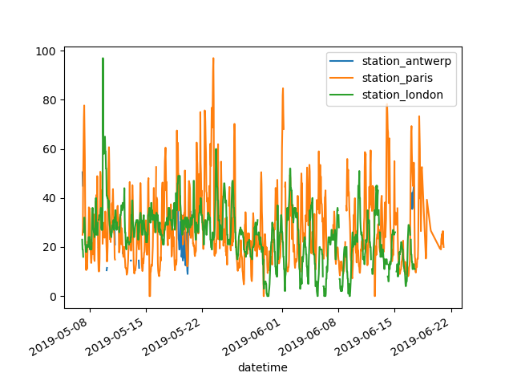
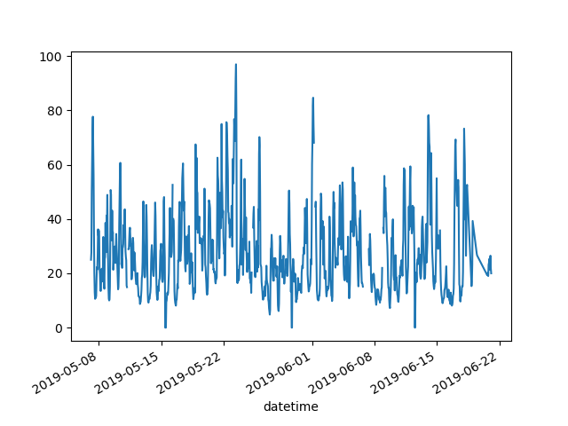
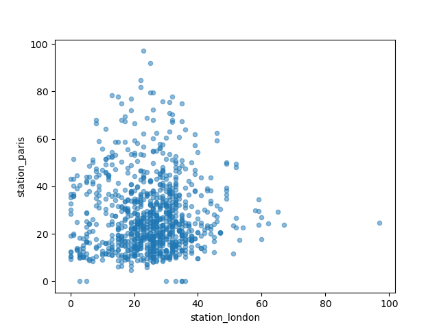
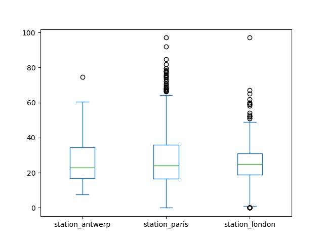
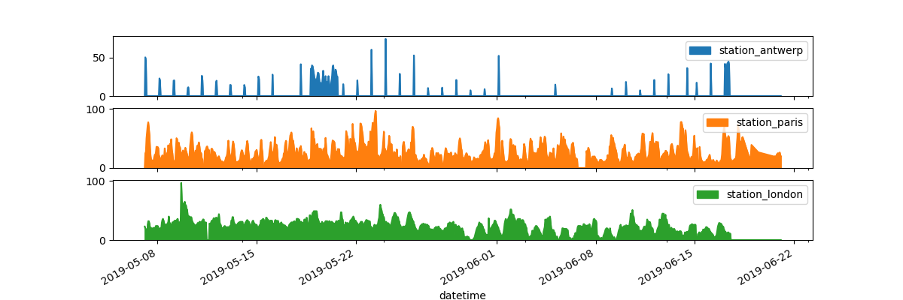
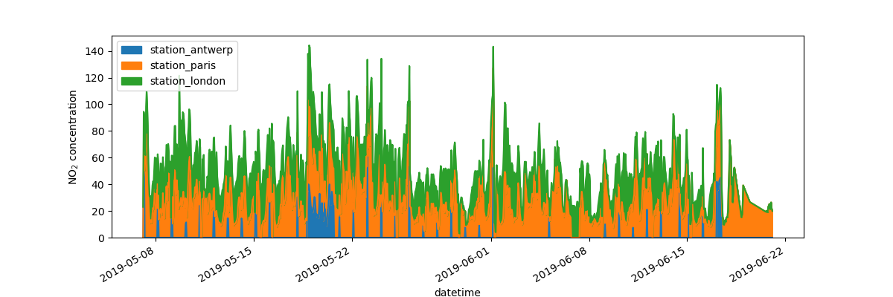

# Pandas
pandas is an open source, BSD-licensed library providing high-performance, easy-to-use data structures and data analysis tools for Python. 

## intro
```py
import pandas as pd # pip install pandas

df = pd.DataFrame(
    { # col header as dict key, col vals as dict vals
        "Name": [
            "Braund, Mr. Owen Harris",
            "Allen, Mr. William Henry",
            "Bonnell, Miss. Elizabeth",
        ],
        "Age": [22, 35, 58],
        "Sex": ["male", "male", "female"],
    }
)
print(df)
#                        Name  Age     Sex
# 0   Braund, Mr. Owen Harris   22    male
# 1  Allen, Mr. William Henry   35    male
# 2  Bonnell, Miss. Elizabeth   58  female

print(df['Age']) # a col without label is also called a series in pandas, they have row labels, but not col label
# 0    22
# 1    35
# 2    58
# Name: Age, dtype: int64

ages = pd.Series([22, 35, 58], name="Age") # can create series directly
print(ages)
# 0    22
# 1    35
# 2    58
# Name: Age, dtype: int64

print(df["Age"].max()) # 58
print(ages.max()) # 58

print(df.describe()) # show basic stats of the numerical data in the table, return Series or DataFrame datatype
#              Age
# count   3.000000
# mean   38.333333
# std    18.230012
# min    22.000000
# 25%    28.500000
# 50%    35.000000
# 75%    46.500000
# max    58.000000
```

## read & write tabular data
```py
# pandas supports many diff file formats (csv, excel, sql, json, parquet, …), with prefix read_...
titanic = pd.read_csv("data/titanic.csv") # read csv file into a pd DataFrame

# always have a check on the data after reading in the data (print or see in interactive window)
print(titanic)
print(titanic.head(8)) # show first 8 rows
print(titanic.tail(3)) # show last 3 rows
print(titanic.dtypes) # show datatypes of each col
# PassengerId      int64
# Survived         int64
# Pclass           int64
# Name            object
# Sex             object
# Age            float64
# SibSp            int64
# Parch            int64
# Ticket          object
# Fare           float64
# Cabin           object
# Embarked        object
# dtype: object

titanic.to_excel("data/titanic.xlsx", sheet_name="passengers", index=False) # convert to excel file

print(titanic.info()) # show stats
# <class 'pandas.core.frame.DataFrame'>
# RangeIndex: 891 entries, 0 to 890
# Data columns (total 12 columns):
#  #   Column       Non-Null Count  Dtype  
# ---  ------       --------------  -----  
#  0   PassengerId  891 non-null    int64  
#  1   Survived     891 non-null    int64  
#  2   Pclass       891 non-null    int64  
#  3   Name         891 non-null    object 
#  4   Sex          891 non-null    object 
#  5   Age          714 non-null    float64
#  6   SibSp        891 non-null    int64  
#  7   Parch        891 non-null    int64  
#  8   Ticket       891 non-null    object 
#  9   Fare         891 non-null    float64
#  10  Cabin        204 non-null    object 
#  11  Embarked     889 non-null    object 
# dtypes: float64(2), int64(5), object(5)
# memory usage: 83.7+ KB
```

## select a subset of DataFrame
```py
import pandas as pd
titanic = pd.read_csv("data/titanic.csv")
print(type(titanic["Age"])) # <class 'pandas.core.series.Series'> # Each col in a DataFrame is a Series
print(titanic["Age"].shape) # (891,) # A Series is 1d, so only num of rows is returned

age_sex = titanic[["Age", "Sex"]] # select multiple columns with []
print(age_sex.head(5))
#     Age     Sex
# 0  22.0    male
# 1  38.0  female
# 2  26.0  female
# 3  35.0  female
# 4  35.0    male
print(type(titanic[["Age", "Sex"]])) # <class 'pandas.core.frame.DataFrame'>
print(titanic[["Age", "Sex"]].shape) # (891, 2)

above_35 = titanic[titanic["Age"] > 35] # select rows with age > 35
print(above_35.head(5))
#     PassengerId  Survived  Pclass                                               Name     Sex  ...  Parch    Ticket     Fare Cabin  Embarked
# 1             2         1       1  Cumings, Mrs. John Bradley (Florence Briggs Th...  female  ...      0  PC 17599  71.2833   C85         C
# 6             7         0       1                            McCarthy, Mr. Timothy J    male  ...      0     17463  51.8625   E46         S
# 11           12         1       1                           Bonnell, Miss. Elizabeth  female  ...      0    113783  26.5500  C103         S
# 13           14         0       3                        Andersson, Mr. Anders Johan    male  ...      5    347082  31.2750   NaN         S
# 15           16         1       2                   Hewlett, Mrs. (Mary D Kingcome)   female  ...      0    248706  16.0000   NaN         S

# [5 rows x 12 columns]
print(above_35.shape) # (217, 12)

class_23 = titanic[titanic["Pclass"].isin([2, 3])] # select rows with Pclass with vals 2 & 3
print(class_23.head(5))
#    PassengerId  Survived  Pclass                            Name     Sex   Age  SibSp  Parch            Ticket     Fare Cabin Embarked
# 0            1         0       3         Braund, Mr. Owen Harris    male  22.0      1      0         A/5 21171   7.2500   NaN        S
# 2            3         1       3          Heikkinen, Miss. Laina  female  26.0      0      0  STON/O2. 3101282   7.9250   NaN        S
# 4            5         0       3        Allen, Mr. William Henry    male  35.0      0      0            373450   8.0500   NaN        S
# 5            6         0       3                Moran, Mr. James    male   NaN      0      0            330877   8.4583   NaN        Q
# 7            8         0       3  Palsson, Master. Gosta Leonard    male   2.0      3      1            349909  21.0750   NaN        S
class_23 = titanic[(titanic["Pclass"] == 2) | (titanic["Pclass"] == 3)] # same select using the or operator "|" (note: cannot user "or" directly)

age_no_na = titanic[titanic["Age"].notna()] # select rows where age is not null
print(age_no_na.head(3))
#    PassengerId  Survived  Pclass                                               Name  ...            Ticket     Fare  Cabin  Embarked
# 0            1         0       3                            Braund, Mr. Owen Harris  ...         A/5 21171   7.2500    NaN         S
# 1            2         1       1  Cumings, Mrs. John Bradley (Florence Briggs Th...  ...          PC 17599  71.2833    C85         C
# 2            3         1       3                             Heikkinen, Miss. Laina  ...  STON/O2. 3101282   7.9250    NaN         S
# 
# [3 rows x 12 columns]

adult_names = titanic.loc[titanic["Age"] > 35, "Name"] # select name col with age col val > 35, note the loc operator here
print(adult_names.head(3))
# 1     Cumings, Mrs. John Bradley (Florence Briggs Th...
# 6                               McCarthy, Mr. Timothy J
# 11                             Bonnell, Miss. Elizabeth
# Name: Name, dtype: object
print(type(adult_names)) # <class 'pandas.core.series.Series'>

print(titanic.iloc[9:13, 2:5]) # select rows 10 to 13 and cols 3 to 5, note the iloc operator here
#     Pclass                                 Name     Sex
# 9        2  Nasser, Mrs. Nicholas (Adele Achem)  female
# 10       3      Sandstrom, Miss. Marguerite Rut  female
# 11       1             Bonnell, Miss. Elizabeth  female
# 12       3       Saundercock, Mr. William Henry    male

titanic.iloc[0:3, 3] = "anonymous" # assign new values to first 3 row of col #3 (which is name col)
print(titanic.head(5))
#    PassengerId  Survived  Pclass                                          Name     Sex  ...  Parch            Ticket     Fare Cabin  Embarked
# 0            1         0       3                                     anonymous    male  ...      0         A/5 21171   7.2500   NaN         S
# 1            2         1       1                                     anonymous  female  ...      0          PC 17599  71.2833   C85         C
# 2            3         1       3                                     anonymous  female  ...      0  STON/O2. 3101282   7.9250   NaN         S
# 3            4         1       1  Futrelle, Mrs. Jacques Heath (Lily May Peel)  female  ...      0            113803  53.1000  C123         S
# 4            5         0       3                      Allen, Mr. William Henry    male  ...      0            373450   8.0500   NaN         S

# [5 rows x 12 columns]
```
## create plots
```py
import pandas as pd
import matplotlib.pyplot as plt

air_quality = pd.read_csv(
    "data/air_quality_no2.csv", 
    index_col=0, # define the first col as idx of the returned dataframe
    parse_dates=True) # convert dates to timestamp objs

print(type(air_quality)) # <class 'pandas.core.frame.DataFrame'>

print(air_quality.head())
#                      station_antwerp  station_paris  station_london
# datetime                                                           
# 2019-05-07 02:00:00              NaN            NaN            23.0
# 2019-05-07 03:00:00             50.5           25.0            19.0
# 2019-05-07 04:00:00             45.0           27.7            19.0
# 2019-05-07 05:00:00              NaN           50.4            16.0
# 2019-05-07 06:00:00              NaN           61.9             NaN

air_quality.plot() # With a DataFrame, pandas creates by default one line plot for each of the columns with numeric data
plt.show()
```
Output image:



```py
air_quality["station_paris"].plot() # the plot() method works on both Series and DataFrame
plt.show()
```
Output image:



```py
air_quality.plot.scatter(x="station_london", y="station_paris", alpha=0.5)
plt.show()
```
Output image:




```py
air_quality.plot.box() # box plot
plt.show()
```
Output image:



```py
axs = air_quality.plot.area(figsize=(12, 4), subplots=True) # separate subplots for each of the data cols 
plt.show()
```
Output image:



```py
fig, axs = plt.subplots(figsize=(12, 4)) # create an empty Matplotlib Figure and Axes
air_quality.plot.area(ax=axs) # use pandas to put the area plot on the prepared Figure/Axes
axs.set_ylabel("NO$_2$ concentration") # Matplotlib customization
fig.savefig("images/06-air-quality.png") # save the figure using the existing Matplotlib method.
plt.show() # display the plot
```
Output image:



## create new columns from existing columns
```py
import pandas as pd
air_quality = pd.read_csv("data/air_quality_no2.csv", index_col=0, parse_dates=True)
print(air_quality.head())
#                      station_antwerp  station_paris  station_london
# datetime                                                           
# 2019-05-07 02:00:00              NaN            NaN            23.0
# 2019-05-07 03:00:00             50.5           25.0            19.0
# 2019-05-07 04:00:00             45.0           27.7            19.0
# 2019-05-07 05:00:00              NaN           50.4            16.0
# 2019-05-07 06:00:00              NaN           61.9             NaN

air_quality["london_mg_per_cubic"] = air_quality["station_london"] * 1.882 # create a new col from existing col
print(air_quality.head())
#                      station_antwerp  station_paris  station_london  london_mg_per_cubic
# datetime                                                                                
# 2019-05-07 02:00:00              NaN            NaN            23.0               43.286
# 2019-05-07 03:00:00             50.5           25.0            19.0               35.758
# 2019-05-07 04:00:00             45.0           27.7            19.0               35.758
# 2019-05-07 05:00:00              NaN           50.4            16.0               30.112
# 2019-05-07 06:00:00              NaN           61.9             NaN                  NaN

air_quality["ratio_paris_antwerp"] = (
    air_quality["station_paris"] / air_quality["station_antwerp"]
)
print(air_quality.head())
#                      station_antwerp  station_paris  station_london  london_mg_per_cubic  ratio_paris_antwerp
# datetime                                                                                                     
# 2019-05-07 02:00:00              NaN            NaN            23.0               43.286                  NaN
# 2019-05-07 03:00:00             50.5           25.0            19.0               35.758             0.495050
# 2019-05-07 04:00:00             45.0           27.7            19.0               35.758             0.615556
# 2019-05-07 05:00:00              NaN           50.4            16.0               30.112                  NaN
# 2019-05-07 06:00:00              NaN           61.9             NaN                  NaN                  NaN

air_quality_renamed = air_quality.rename( # rename col labels using a dict, can also used to rename row labels
    columns={
        "station_antwerp": "BETR801",
        "station_paris": "FR04014",
        "station_london": "London Westminster",
    }
)
print(air_quality_renamed.head())
#                      BETR801  FR04014  London Westminster  london_mg_per_cubic  ratio_paris_antwerp
# datetime                                                                                           
# 2019-05-07 02:00:00      NaN      NaN                23.0               43.286                  NaN
# 2019-05-07 03:00:00     50.5     25.0                19.0               35.758             0.495050
# 2019-05-07 04:00:00     45.0     27.7                19.0               35.758             0.615556
# 2019-05-07 05:00:00      NaN     50.4                16.0               30.112                  NaN
# 2019-05-07 06:00:00      NaN     61.9                 NaN                  NaN                  NaN

air_quality_renamed = air_quality_renamed.rename(columns=str.lower) # rename all col labels to its lower case
print(air_quality_renamed.head())
#                      betr801  fr04014  london westminster  london_mg_per_cubic  ratio_paris_antwerp
# datetime                                                                                           
# 2019-05-07 02:00:00      NaN      NaN                23.0               43.286                  NaN
# 2019-05-07 03:00:00     50.5     25.0                19.0               35.758             0.495050
# 2019-05-07 04:00:00     45.0     27.7                19.0               35.758             0.615556
# 2019-05-07 05:00:00      NaN     50.4                16.0               30.112                  NaN
# 2019-05-07 06:00:00      NaN     61.9                 NaN                  NaN                  NaN
```

## calculate summary statistics

## reshape the layout of tables

## combine data from multiple sources

## handle time series data

## manipulate textual data


## References
- `https://pandas.pydata.org/docs/getting_started/intro_tutorials/`